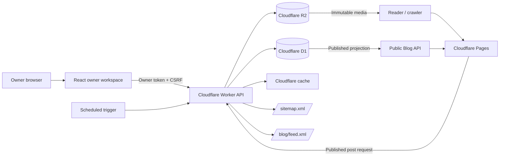
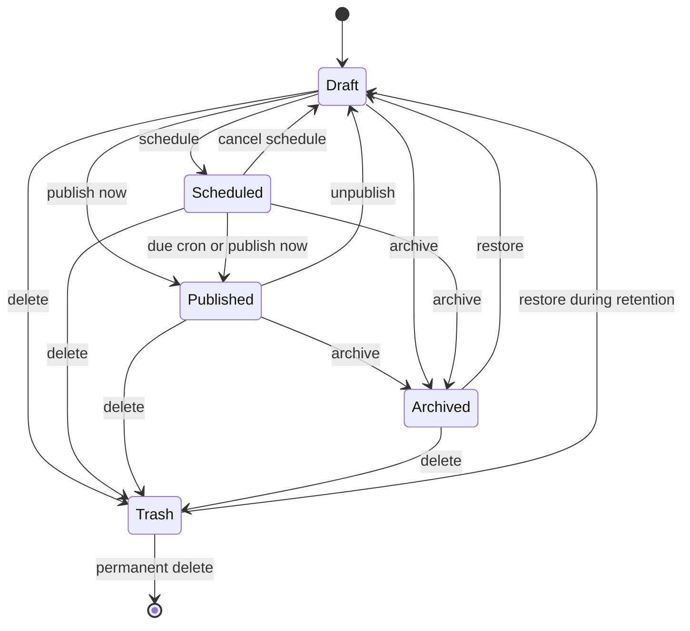
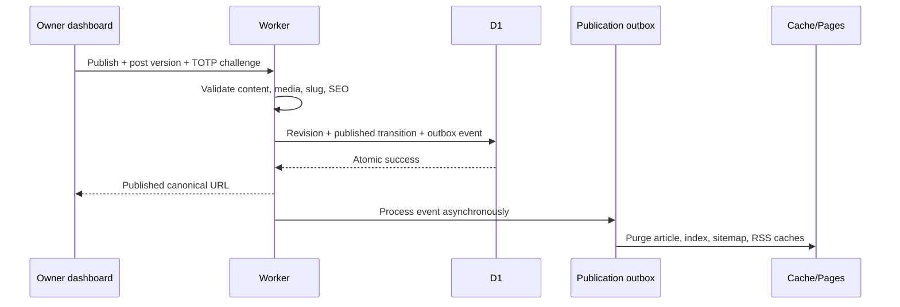

# Runway Systems Blog — System Architecture and Automation Proposal

**Status:** Approved and implemented
**Decision date:** 18 September 2026
**Implementation date:** 18 September 2026
**Newsletter and footer amendment:** 19 September 2026
**Scope:** Architecture, automation, security, owner workflow, public rendering, and acceptance criteria

## 1. Executive decision

Build the Runway Systems Blog as a first-party publishing capability inside the
existing Runway Systems platform rather than introducing an external CMS.

The recommended design uses:

- the existing React storefront for the public Blog and owner workspace;
- a hybrid visual and Markdown editor with Markdown as the portable canonical
  format;
- Cloudflare D1 for posts, revisions, media metadata, taxonomies, redirects,
  and a durable publication outbox;
- Cloudflare R2 for verified cover and inline media;
- the existing Worker authentication, CSRF, TOTP, audit, and rate-limit
  controls for owner operations;
- explicit lifecycle transition endpoints instead of arbitrary public-state
  updates;
- a scheduled Worker task for due publications and outbox retries;
- a Cloudflare Pages rendering layer for first-response article HTML and SEO;
- authoritative dynamic sitemap and RSS endpoints generated from published
  records only.

This creates public pages without a source-code change or storefront redeploy.
D1 is the editorial source of truth, R2 is the media source of truth, and only
a strict published projection is visible publicly.

## 2. Confirmed product decisions

| Area | Selected design preference |
|---|---|
| Editor | Hybrid visual editor plus Markdown source/import/export |
| AI import | Paste or upload AI-written content; always create a reviewable private draft |
| Media | Full reusable media library with cover and inline images |
| Roles | Owner-only; no premature multi-editor permission model |
| Visual direction | Premium “Runway Editorial” UI using the existing brand and themes |
| Responsiveness | Complete reader and owner workflows from 320px through wide desktop screens |
| Distribution | Website, dynamic sitemap, RSS, robots policy, and LLM discovery files |

## 3. Design principles

1. **Private by default.** New and incomplete content cannot be returned by a
   public query.
2. **One source of truth.** The post record and its version govern every public
   representation.
3. **Explicit transitions.** Publish, schedule, unpublish, archive, restore,
   and permanently delete are named operations with validation and audit logs.
4. **Portable content.** Markdown can be imported, exported, versioned, and
   recovered without depending on the editor library.
5. **Safe rendering.** No stored raw HTML, script embeds, arbitrary iframes, or
   client-supplied rendered HTML.
6. **Immutable public media.** Replacing an image creates a new object URL so
   caches never return the wrong asset.
7. **SEO at first response.** Article identity and content are available to
   crawlers without requiring client-side JavaScript.
8. **Reliable automation.** Database transitions succeed independently of
   cache invalidation; a durable outbox retries secondary work.
9. **Recover before destroying.** Revisions and trash retention protect the
   owner from accidental loss.
10. **No commerce regression.** Blog traffic and publishing data remain
    separate from paid orders, revenue, conversion, and Complimentary Access.

## 4. Context architecture



### Trust boundaries

- The dashboard is untrusted input even though the user is the owner.
- The Worker is the only authority allowed to change publishing state.
- D1 records determine whether content is public; the client cannot override
  lifecycle rules.
- R2 object URLs do not imply publication. Public media delivery is allowed
  only for active, verified media records.
- Pages renders only the Worker's published projection.

## 5. Editorial state machine



### Public visibility predicate

A post is public only when all conditions are true:

```text
status = 'published'
AND published_at IS NOT NULL
AND published_at <= current server time
AND deleted_at IS NULL
```

Every public article query, related-post query, sitemap query, RSS query, and
server-rendering query must contain the same predicate through one shared
repository function.

### Transition requirements

- **Publish:** complete article, valid taxonomy, SEO values within bounds,
  every referenced media item verified, and alt text present for meaningful
  images.
- **Schedule:** all publish requirements plus a future server-normalized time.
- **Unpublish:** immediately remove public access while preserving the original
  publication date and canonical slug history.
- **Archive:** remove public access and preserve the editorial record.
- **Trash:** remove public access immediately, retain for 30 days by default.
- **Permanent delete:** elevated confirmation after retention or an explicit
  owner override; media cleanup occurs asynchronously.

## 6. Content model

### 6.1 `blog_posts`

| Field | Purpose |
|---|---|
| `id` | UUID primary key |
| `slug` | Current canonical slug, unique |
| `title` | Public headline |
| `excerpt` | Index, metadata, and RSS summary |
| `body_markdown` | Canonical portable article body |
| `status` | `draft`, `scheduled`, `published`, or `archived` |
| `category_id` | Primary category |
| `author_name` | Public byline, default Runway Systems |
| `cover_media_id` | Optional media record |
| `seo_title` | Optional explicit search title |
| `seo_description` | Optional explicit search description |
| `is_featured` | Editorial promotion flag |
| `scheduled_at` | Desired publication time |
| `first_published_at` | Stable first-publication date |
| `published_at` | Current publication timestamp |
| `created_by` | Owner account provenance |
| `version` | Optimistic-concurrency integer |
| `created_at`, `updated_at` | Audit and `lastmod` timestamps |
| `deleted_at` | Trash retention marker |

Normal editing locks a slug after first publication. A separate elevated
"change canonical URL" operation may change it only by atomically creating a
permanent redirect from the old slug.

### 6.2 `blog_post_revisions`

Immutable snapshots containing the complete editorial fields, post version,
checkpoint reason, creator, and timestamp.

Create revisions:

- before first publication;
- before each update to a currently published article;
- before unpublishing, archiving, restoring, or changing a canonical slug;
- at explicit owner checkpoints;
- periodically during a long editing session, but not for every autosave.

Retain at least the latest 20 revisions per post plus all publication
milestones. Restoring creates a new head version; it never rewrites history.

### 6.3 `blog_media`

| Field | Purpose |
|---|---|
| `id` | Stable media ID |
| `r2_key` | Random immutable storage key |
| `mime_type` | Server-verified PNG, JPEG, or WebP type |
| `byte_size` | Upload limit enforcement |
| `width`, `height` | Layout and decompression-bomb checks |
| `sha256` | Integrity and duplicate detection |
| `alt_text` | Reusable accessibility description |
| `caption` | Optional editorial caption |
| `original_name` | Owner-only filename metadata |
| `status` | `processing`, `ready`, `quarantined`, or `trashed` |
| `created_by`, `created_at` | Provenance |
| `deleted_at` | Delayed cleanup marker |

### 6.4 `blog_post_media`

A junction table records post-to-media use, including `cover` or `inline` role.
It supports usage counts, prevents deletion of in-use media, and enables safe
orphan cleanup.

### 6.5 Taxonomy

`blog_categories` provides managed names, slugs, descriptions, ordering, and
active status. Tags are normalized in `blog_tags` with a post-tag junction.
This prevents spelling variants from fragmenting filters and future search.

### 6.6 `blog_slug_redirects`

Stores old slug, destination post, creation timestamp, and reason. Public
requests return a permanent redirect to the current canonical URL. Redirect
chains are forbidden; all old slugs point directly to the latest slug.

### 6.7 `blog_publication_outbox`

A transactional outbox records publication-side effects:

- post ID and resulting version;
- event type;
- creation time;
- processing attempts;
- last error;
- completion time.

The post mutation and outbox event are committed together. Cache invalidation
or feed regeneration failures therefore cannot lose the required follow-up
work.

## 7. Hybrid editor architecture

### Canonical representation

Markdown is canonical. The visual editor supports a deliberately bounded,
round-trip-safe schema:

- paragraphs and headings;
- bold, italic, strike-through, and inline code;
- ordered and unordered lists;
- block quotes;
- links;
- fenced code blocks;
- tables;
- horizontal rules;
- images with alt text and captions.

Raw HTML, arbitrary embeds, inline styles, and scripts are excluded. Visual
mode converts this schema deterministically to Markdown. Source mode parses it
back into the same document model. Unsupported imported syntax is reported
before saving rather than silently discarded.

### Editing experience

- Visual, Markdown source, and public-preview modes.
- Formatting toolbar and keyboard shortcuts.
- Drag/drop media from the owner library.
- `.md` and `.txt` import with size and encoding validation.
- Markdown export at any time.
- Debounced autosave after two seconds of inactivity.
- Browser-local crash-recovery buffer until server acknowledgement.
- Visible save state: unsaved, saving, saved, conflict, or offline.
- Word count, estimated reading time, and publish-readiness checklist.

### Concurrency

Every update carries the last observed `version`. The Worker performs a
compare-and-swap update. If versions differ, it returns `409 Conflict` with the
latest server version instead of silently overwriting content. This also
protects against two open owner tabs.

### AI-created content import

The owner does not need to handle HTML, JSON, or website code. The workspace
provides three simple choices: **Write**, **Paste AI article**, and **Upload
document**. Markdown, plain text, and a deliberately supported document format
are converted into the canonical article schema and always saved as a private
draft.

The import pipeline extracts safe headings, paragraphs, lists, tables, links,
and image references; removes scripts, styles, forms, iframes, event handlers,
and tracking code; validates links and heading order; reports unsupported
content; and opens the result in the normal visual editor for owner review.
Uploaded AI-generated HTML is treated only as content input and is never
executed or hosted as an independent page. Runway Systems owns the page layout,
responsive behavior, metadata, navigation, and security.

An optional validated article package may contain one article plus local
images. Archive limits, path-traversal protection, decompression-ratio limits,
file-count limits, media byte verification, and manifest validation are
required. AI import must never publish automatically, and automated quality
warnings cannot replace the owner's factual, copyright, citation, and brand
review.

## 8. Media pipeline

1. Owner selects or drops a file.
2. Browser checks basic size and format, removes EXIF through normalization,
   and creates an accessible preview.
3. Worker accepts authenticated multipart data with strict byte limits.
4. Worker verifies magic bytes, dimensions, MIME type, and integrity hash.
5. Unsupported, malformed, oversized, or suspicious files are rejected.
6. A UUID-based immutable R2 key is generated; user filenames never become
   object keys.
7. D1 media metadata is written only after R2 succeeds.
8. The media becomes selectable only in `ready` state.
9. Replacing an image creates a new media version; old URLs remain immutable.
10. Trashed, unreferenced objects are deleted after a recovery grace period.

Recommended initial limits:

- PNG, JPEG, and WebP only;
- no SVG, GIF, HTML, PDF, or video in article media;
- 8 MB source file maximum;
- 6,000 × 6,000 pixel maximum;
- descriptive alt text required for meaningful published images;
- decorative images explicitly marked so they render with empty alt text.

Media responses use correct MIME types, `X-Content-Type-Options: nosniff`, a
restrictive CSP where applicable, and one-year immutable caching.

## 9. API boundaries

### Public endpoints

| Method and route | Behavior |
|---|---|
| `GET /blog/posts` | Cursor-paginated published summaries; category/tag filters |
| `GET /blog/posts/:slug` | One published post, related articles, or redirect result |
| `GET /blog/categories` | Active categories with published counts |
| `GET /blog/media/:id/:version` | Verified immutable media only |
| `GET /blog/feed.xml` | Latest published articles as RSS 2.0 |
| `GET /sitemap.xml` | Static, product, blog-index, and published article URLs |

Public serializers omit owner IDs, draft fields, scheduling details,
revision data, internal media keys, and deletion metadata.

### Owner endpoints

| Method and route | Behavior |
|---|---|
| `GET /admin/blog/posts` | Paginated summaries and filters, not every full body |
| `POST /admin/blog/posts` | Create private draft |
| `GET /admin/blog/posts/:id` | Full owner-only editor record |
| `PATCH /admin/blog/posts/:id` | Versioned draft/content update |
| `POST /admin/blog/posts/:id/publish` | Validated immediate publication |
| `POST /admin/blog/posts/:id/schedule` | Validated future publication |
| `POST /admin/blog/posts/:id/unpublish` | Remove public visibility |
| `POST /admin/blog/posts/:id/archive` | Archive privately |
| `POST /admin/blog/posts/:id/restore` | Restore archived or trashed post |
| `DELETE /admin/blog/posts/:id` | Trash; explicit second operation for permanent delete |
| `GET /admin/blog/posts/:id/revisions` | Revision summaries |
| `POST /admin/blog/posts/:id/revisions/:revision/restore` | Restore as a new version |
| `GET/POST /admin/blog/media` | Browse or upload media |
| `PATCH/DELETE /admin/blog/media/:id` | Edit metadata or trash unused media |
| `POST /admin/blog/posts/:id/change-slug` | Elevated slug change plus redirect |

Lifecycle endpoints are separate so validation, authorization, auditing, and
cache behavior cannot be bypassed by setting a `status` field in a generic
update.

## 10. Authentication and security

### Authorization levels

- **Draft reads and autosaves:** authenticated verified owner, exact owner
  allowlist, CSRF, origin validation, and rate limiting.
- **Media upload:** owner controls plus upload-specific byte and rate limits.
- **Publish, schedule, unpublish, archive, restore, slug change, trash, and
  permanent delete:** short-lived TOTP elevation in addition to owner controls.

### Rendering controls

- Never accept rendered HTML from the browser.
- Parse Markdown through a strict AST schema.
- Ignore raw HTML nodes.
- Permit only `https`, safe internal paths, `mailto`, and `tel` where relevant.
- Add `noopener noreferrer` to external links.
- Do not permit arbitrary iframe, style, event-handler, data, or JavaScript
  URLs.
- Enforce title, excerpt, body, tag, URL, and metadata lengths server-side.
- Return sanitized errors with correlation IDs.

### Audit events

Record post/media ID, action, owner ID, request correlation ID, before/after
status, and timestamp. Do not copy article bodies or raw filenames into audit
messages.

## 11. Public rendering architecture

### Runway Editorial visual direction

The public Blog is a premium, restrained editorial system rather than a
generic card grid. It uses the existing Runway Systems identity, palette and
light/dark themes with fluid display typography, generous whitespace, subtle
texture or colour glow, asymmetric featured content, carefully limited motion,
and a highly readable long-form body. Approved article components include key
takeaways, examples, checklists, notes, quotes, statistics, responsive tables,
figures, and restrained product references. Uploaded content cannot introduce
arbitrary CSS or alter global branding.

The launch design adapts to archive size: a featured story plus chronological
list for a small archive; categories, search and curated collections appear
only when enough published content exists to make them useful. It avoids empty
magazine sections, aggressive promotional banners, excessive glass effects,
low-contrast typography, and motion that competes with reading.

### Blog index

`/blog` contains:

- branded Blog introduction;
- featured article area;
- cursor-paginated responsive cards;
- category and tag discovery;
- optional title/excerpt search at launch or as a later indexed enhancement;
- reading time and publication date;
- links from global navigation and footer;
- an RSS discovery link.

A homepage "Latest from the Blog" module can surface recent posts without
coupling article publication to a storefront build.

### Article page

`/blog/:slug` provides:

- semantic `main`, `article`, `header`, heading, figure, and time elements;
- responsive cover and inline media with width/height to prevent layout shift;
- public author, category, tags, publication/update dates, and reading time;
- related published articles;
- an unobtrusive relevant-product call to action;
- existing storefront navigation, theme, palette, footer, and accessibility
  behavior.

### First-response SEO rendering

A Pages Function requests the published article projection and renders the
initial semantic article and head metadata. The client then hydrates the same
shared article component. This gives crawlers actual content in the first HTML
response while retaining the React storefront experience.

If the rendering service cannot reach the Worker, it returns a short-lived
503 rather than incorrectly serving homepage metadata at an article URL.
Unpublished or unknown slugs return a real 404 with `noindex`.

## 12. SEO specification

Each published article receives:

- unique title and meta description;
- canonical storefront URL;
- Open Graph `article` metadata;
- Twitter/X large-image card metadata;
- absolute image URLs and image alt metadata;
- `BlogPosting` JSON-LD;
- breadcrumb JSON-LD;
- `datePublished` and `dateModified`;
- author and publisher identity;
- crawlable related-article links;
- RSS alternate-link discovery;
- redirect-aware canonical handling.

The editor shows live search and social previews. Publishing warns about weak
metadata but safely derives defaults from title and excerpt where possible.

## 13. Sitemap automation

The Worker serves the authoritative sitemap for the canonical storefront
host. It combines:

- static public routes;
- active product routes;
- `/blog`;
- all posts matching the shared public visibility predicate.

Every article entry uses the current canonical slug and `updated_at` as
`lastmod`. Redirect-source slugs never enter the sitemap.

Publication, scheduled publication, published-content update, unpublish,
archive, slug change, trash, restore, and permanent deletion enqueue sitemap
cache invalidation. A short TTL remains as a fallback if invalidation fails.

At 50,000 URLs or 50 MB, the endpoint evolves into a sitemap index with
separate product and Blog sitemap files.

## 14. RSS automation

`/blog/feed.xml` is generated from the latest published records only and
contains:

- channel identity and canonical Blog URL;
- article title, canonical GUID, link, excerpt, author, categories, and
  publication/update dates;
- safely rendered article content or excerpt, using absolute media links;
- a self-referencing Atom feed link.

The feed cache is invalidated by the same outbox events as the sitemap. Draft,
scheduled, archived, trashed, and redirected-source records are excluded.
RSS generation failure never rolls back a successful publication; the outbox
retries it while the prior short-lived feed remains available. RSS remains a
quiet technical discovery option rather than the primary visual call to action.

### Blog email updates

The original site footer visual design remains unchanged; Blog, Newsletter,
and quiet RSS links use its existing navigation columns. The newsletter signup
section sits above the original footer signature and navigation on the
homepage, product pages, Blog index, and published articles. It is omitted from
cart, account, claim, confirmation, admin, legal, and error contexts. Articles
remain fully public and are never gated by email.

Subscriptions use first-party, double opt-in infrastructure. A public request
requires explicit consent, bounded input, a blank honeypot, exact-origin CORS,
and per-IP plus per-email rate limits. Brevo sends a confirmation link whose
opaque token is carried in the URL fragment. The raw token is never stored;
D1 stores only its SHA-256 hash, email, source, policy version, and 48-hour
expiry. Opening the page does not subscribe the recipient. A one-time POST
confirmation activates marketing consent in the existing unified audience.
Existing suppression and unsubscribe controls remain authoritative, and login,
purchase, waitlist, complimentary access, or feedback never imply consent.

### Robots and LLM discovery

`robots.txt` allows the public Blog and article routes, disallows dashboard,
preview, account and other private routes, and declares the canonical sitemap.
It does not list individual articles and is never treated as an authorization
control.

`llms.txt` provides a concise description of the Runway Systems Blog, its public
index, RSS feed, sitemap, topic collections, and a bounded list of featured or
recent published articles. If the archive grows, `llms-full.txt` may expose the
complete published article directory. Both are generated from the same public
visibility predicate as sitemap and RSS, and the publication outbox
invalidates their caches on every visibility-changing operation. Draft,
scheduled, archived, trashed and preview content can never appear.

These files improve machine discovery but do not guarantee search ranking, AI
citation or indexing; semantic first-response content, canonical metadata,
internal links and the sitemap remain more important.

## 15. Publication automation

### Publish now



### Scheduled publication

The scheduled Worker runs at least every five minutes:

1. Select due scheduled posts using server time.
2. Atomically transition each still-due version to published.
3. Create publication revision and outbox event.
4. Drain unprocessed outbox events.
5. Retry failures with bounded exponential backoff.
6. Mark repeatedly failing events for owner-visible operational attention.

The job is idempotent: a post can transition to published only once for the
same version.

### Published update

Updating a public article creates a revision, increments the version and
`updated_at`, and invalidates article, index, sitemap, RSS, and related-post
caches. The canonical URL stays stable unless the owner uses the dedicated
redirect-producing slug operation.

### Unpublish, archive, or trash

The D1 visibility transition happens first. Public reads immediately fail the
published predicate. Cache purges and feed/sitemap refreshes are durable
secondary work through the outbox.

## 16. Caching and consistency

| Resource | Policy |
|---|---|
| Draft/admin responses | `private, no-store` |
| Published article API | Short edge TTL plus explicit versioned invalidation |
| Blog index | Short edge TTL plus publication invalidation |
| Sitemap and RSS | Short TTL plus outbox invalidation |
| Immutable R2 media | One year, immutable |
| 404/private article result | Very short or no cache |
| Redirect | Long public cache after redirect record commits |

Database state always takes precedence over cache state. Public endpoints
re-check the visibility predicate, and cache keys include article version where
appropriate.

## 17. Failure handling

| Failure | Required behavior |
|---|---|
| D1 mutation fails | No state change, no cache purge, owner sees correlated error |
| R2 upload fails | No ready media record is created |
| D1 media insert fails after R2 put | Object is marked for orphan cleanup |
| Cache purge fails | Outbox retries; short TTL limits stale state |
| RSS rebuild fails | Publication succeeds; previous feed remains briefly; retry |
| Scheduled cron repeats | Idempotent status/version guard prevents double publish |
| Two tabs save | Older version receives 409 and cannot overwrite silently |
| Pages cannot fetch article | Short-lived 503, never incorrect canonical content |
| Owner deletes in-use media | Rejected with usage list |
| Permanent deletion partially fails | D1 tombstone remains; cleanup job retries objects |

## 18. Recovery and retention

- D1 point-in-time recovery remains the database-level recovery mechanism.
- Immutable post revisions support article-level restore.
- Markdown export provides platform-independent content backup.
- R2 inventory and checksums support media integrity checks.
- Trashed posts and media have a default 30-day retention period.
- Orphan cleanup never deletes newly uploaded objects immediately.
- Audit history preserves lifecycle provenance without storing article bodies.
- Recovery documentation must cover post restore, revision restore, media
  relinking, outbox replay, sitemap verification, and RSS verification.

## 19. Analytics boundaries

Blog metrics may use the existing anonymous analytics path for:

- article view;
- category and article slug;
- referral class;
- optional read-depth milestones.

Do not collect article-reader email or identity by default. The separate,
explicit double-opt-in Blog form is the only Blog email collection path and
is not inferred from reading activity. Blog events must not increment checkout
starts, conversion, paid sales, revenue, or average
order metrics. Complimentary Access and feedback behavior remain unchanged.

## 20. Responsiveness, accessibility, and performance budgets

Responsiveness is an acceptance requirement for both readers and the owner,
not a desktop layout patched after implementation. The design must work at
320–479px compact phone, 480–767px large phone, 768–1023px tablet,
1024–1439px desktop, and 1440px-and-wider screens, including portrait,
landscape, keyboard, pointer, and touch interaction.

- Blog cards move from one column on phones to two on tablets and an
  editorial two/three-column composition on desktop.
- Article side rails become an expandable mobile table of contents; body line
  length remains readable on wide displays.
- Images scale without layout shift, tables and code scroll inside their own
  containers, and no page has horizontal overflow at 320px.
- The dashboard uses library/editor/settings columns on desktop, collapsible
  panels on tablet, and clear library/editor/preview/publish tabs on phones.
- Every owner operation remains possible on a phone, even though long-form
  writing is naturally more comfortable on a larger screen.
- Logical heading order and keyboard-operable editor controls.
- Alt-text readiness checks and explicit decorative-image handling.
- Visible focus states and existing theme contrast requirements.
- Width and height on every image to prevent layout shift.
- Responsive `srcset` or generated variants where the platform supports them.
- Lazy-load below-the-fold media; prioritize only the article hero.
- Code-split owner editor dependencies away from storefront routes.
- Paginate APIs; never send every article body in the dashboard list.
- Maintain readable line lengths and reduced-motion behavior.

## 21. Deployment model

The implementation should require one platform deployment to install the
publishing system, Worker routes, migrations, Pages rendering function, and
public UI. After that:

- creating an article requires no code commit;
- publishing requires no Pages redeploy;
- updating content requires no Pages redeploy;
- sitemap and RSS changes are automatic;
- scheduling is performed by the Worker cron;
- R2 media URLs remain stable across frontend deployments.

Deployment must apply D1 migrations before enabling the dashboard feature and
verify Worker, Pages Function, media, sitemap, RSS, and scheduled-trigger
configuration before exposing Blog navigation.

## 22. Deliberate non-goals for version one

- Public comments.
- Multi-author permissions or approval chains.
- Automatic AI content generation or automatic publication.
- Automatic marketing-email sends.
- Arbitrary third-party embeds.
- Video hosting.
- Paid or member-only articles.
- An external CMS dependency.

The schema does not prevent future collaboration, but version one avoids role
complexity that provides no benefit to the current owner-only workflow.

## 23. Acceptance criteria for a future implementation

Implementation is complete only when tests prove that:

1. New posts are private drafts.
2. Public APIs cannot return draft, future scheduled, archived, or trashed
   content even when the slug or ID is known.
3. The owner can create, safely paste or upload AI-written content, edit,
   autosave, preview, schedule, publish, update, unpublish, archive, restore,
   and trash an article without handling website code.
4. AI imports always create private drafts, strip executable page code, report
   conversion problems, and require owner review.
5. Version conflicts cannot overwrite newer content.
6. Revision restore creates a new auditable version.
7. Cover and inline media are byte-verified, accessible, immutable, and tracked
   by usage.
8. Published articles and the owner workflow render responsively in both
   themes from 320px through wide screens using storefront design tokens.
9. The initial HTML contains semantic article content, canonical metadata,
   social metadata, and structured data.
10. The authoritative sitemap, RSS, robots policy, and LLM discovery files
    expose published posts only where appropriate.
11. Publish, update, schedule, unpublish, archive, slug change, trash, restore,
    and delete produce the correct discovery result without redeployment.
12. Scheduled publication is idempotent.
13. Old slugs permanently redirect after an approved canonical change.
14. Owner routes enforce authentication, CSRF, elevation where required, rate
    limits, and sanitized errors.
15. Audit events contain no article body or unnecessary personal data.
16. Existing storefront, checkout, account, Complimentary Access, feedback,
    analytics, and security regressions remain green.
17. Build, dependency audit, Worker integration, SEO, feed, media,
    accessibility, and browser-backed responsive tests pass before deployment.

## 24. Implementation phases (approved and completed locally)

The approved implementation has completed phases 1–9. Phase 10 is complete in
local validation and documentation; applying the production migration and
performing the provider-backed rollout remain operator deployment steps.

1. **Architecture freeze:** confirm this proposal and document any amendments.
2. **Persistence:** D1 schema, constraints, repositories, revisions, redirects,
   media metadata, and outbox.
3. **Worker controls:** owner APIs, lifecycle transitions, public projection,
   scheduling, auditing, and concurrency.
4. **Media system:** R2 validation, library APIs, usage tracking, and cleanup.
5. **Owner workspace:** hybrid editor, autosave, import/export, previews,
   taxonomies, revisions, and lifecycle controls.
6. **Public Blog:** index, article, related content, theme, navigation,
   accessibility, and performance.
7. **SEO delivery:** first-response rendering, metadata, structured data,
   canonical redirects, sitemap, and RSS.
8. **Reliability:** outbox retries, operational visibility, recovery, and
   retention jobs.
9. **Validation:** unit, integration, security, browser, SEO, sitemap, RSS,
   media, scheduling, and regression suites.
10. **Deployment:** migration-first rollout, smoke checks, and owner runbook.

This architecture was explicitly approved before implementation began. The
production rollout must continue to follow the migration-first deployment and
smoke-test sequence in `DEPLOYMENT.md`.
